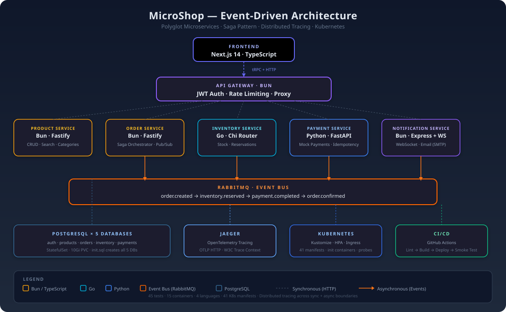

<p align="center">
  
</p>

# microshop — Event-Driven Microservices E-Commerce Platform

[](https://docs.docker.com/compose/)
[](https://minikube.sigs.k8s.io/)
[](https://bun.sh)
[](https://go.dev/)
[](https://python.org)
[](https://nextjs.org/)
[](https://opentelemetry.io/)
[](https://www.jaegertracing.io/)
[](https://rabbitmq.com/)
[]()

A decomposed e-commerce platform built across **4 programming languages**, communicating via **RabbitMQ** with **distributed tracing** across every service. Demonstrates Saga pattern, polyglot microservices, OpenTelemetry instrumentation, and Docker Compose → Kubernetes migration.

<p align="center">
  
</p>

## What It Demonstrates

| Concept | Implementation |
|---|---|
| **Saga Pattern** | Choreographed via RabbitMQ: order.created → inventory.reserved → payment.completed → order.confirmed. Rollback on failure (payment.failed → inventory rollback) |
| **Polyglot Architecture** | 4 languages chosen deliberately per service need — Bun (fast I/O for gateway), Go (concurrency for inventory), Python (ecosystem for payments), Node.js with Fastify (productivity for CRUD) |
| **Distributed Tracing** | OpenTelemetry in every service. W3C Trace Context propagates across HTTP *and* async RabbitMQ hops. End-to-end traces visible in Jaeger |
| **Docker Compose → K8s** | Full Kustomize-based Kubernetes manifests with StatefulSets, init containers for DB migration, HPAs, and nginx ingress with WebSocket support |
| **Real-time Events** | WebSocket server pushes order status updates to the frontend. Notification bell with unread count and animated toast popups |
| **Admin Dashboard** | Role-based access (customer/admin), product CRUD, order management with status updates, stats cards |

## Tech Stack

| Layer | Technology |
|---|---|
| **Frontend** | Next.js 14 (App Router), TypeScript, Tailwind CSS, tRPC |
| **API Gateway** | Bun + Express, JWT auth middleware, rate limiting |
| **Services** | Bun + Fastify (auth, product, order), Go + Chi (inventory), Python + FastAPI (payment), Bun + Express (notification) |
| **Databases** | PostgreSQL ×5 (one per service), SQLite (auth — dev simplicity) |
| **ORM** | Prisma (Node), SQLAlchemy + Alembic (Python) |
| **Message Broker** | RabbitMQ — topic exchanges, dead-letter queues |
| **Auth** | JWT + bcrypt, role-based (customer/admin) |
| **Observability** | OpenTelemetry SDK + Jaeger (OTLP HTTP) |
| **Orchestration** | Docker Compose (dev), Kubernetes / Minikube (deploy) |
| **CI/CD** | GitHub Actions — lint, build, deploy to K8s, smoke test |

## Quick Start

```bash
# Start everything (15 containers)
docker compose up -d

# Check all services are healthy
docker compose ps
```

| Service | URL | Credentials |
|---|---|---|
| Frontend | http://localhost:4000 | — |
| API | http://localhost:3000/api | — |
| Auth | POST /api/auth/register, POST /api/auth/login, GET /api/auth/me | — |
| RabbitMQ | http://localhost:15672 | guest / guest |
| Jaeger | http://localhost:16686 | — |

### Admin Access

Set these in `.env` before first start:
```
ADMIN_EMAIL=admin@example.com
ADMIN_PASSWORD=admin123
```

The seed script creates an admin user. Navigate to `/admin` after logging in.

## Architecture & Data Flow

### Saga: Order Lifecycle

```
Order Placed → [Order Service] publishes "order.created"
  → [Inventory Service] reserves stock → publishes "inventory.reserved"
  → [Payment Service] processes payment → publishes "payment.completed"
  → [Order Service] confirms order → publishes "order.confirmed"
  → [Notification Service] sends email + WebSocket push

Failure Path:
  Payment fails → publishes "payment.failed"
    → Inventory Service rolls back reservation
    → Order Service marks order as cancelled
```

### Tracing

Every service exports OpenTelemetry traces to Jaeger. Trace context propagates across HTTP requests (via headers) and RabbitMQ messages (via W3C Trace Context headers in message properties). Open Jaeger at http://localhost:16686, search by `order.service_name` to see a full order flow trace.

## Services Detail

| Service | Language | Port | Database | Responsibility |
|---|---|---|---|---|
| **API Gateway** | Bun / Express | 3000 | — | Proxy routing, JWT auth middleware, rate limiting |
| **Auth** | Bun / Fastify | 3006 | PostgreSQL | Register, login, JWT issuance, role management |
| **Product** | Bun / Fastify | 3001 | PostgreSQL | CRUD, search, categories (30 seeded products) |
| **Order** | Bun / Fastify | 3002 | PostgreSQL | Order CRUD, Saga state machine, event pub/sub |
| **Inventory** | Go / Chi | 3003 | PostgreSQL | Stock levels, reservations, RabbitMQ consumer |
| **Payment** | Python / FastAPI | 3004 | PostgreSQL | Mock payment processing, idempotency, refunds |
| **Notification** | Bun / Express | 3005 | — | WebSocket broadcast, email (nodemailer) |
| **Frontend** | Next.js 14 | 4000 | — | Product listing, cart, orders, auth, admin panel |

## Testing

```bash
# Unit tests (25 total)
cd services/auth-service && bun test
cd services/product-service && bun test
cd services/order-service && bun test

# Integration tests (20 total — tests all endpoints end-to-end)
node tests/system.mjs
```

**Coverage**: 45 tests — auth (6), product (10), order (9), email formatting (7), cart (8), integration (20).

## Key Design Decisions

- **Bun over Node**: All 5 Node.js services migrated from Node to Bun. 4x faster startup, built-in test runner (zero config), native TypeScript execution (no `tsc` build step), auto `.env` loading.
- **Per-service databases**: Each service owns its data. No shared DB. Enforces service boundaries.
- **Choreographed Saga (not orchestrated)**: Services react to events independently. No central orchestrator to fail. Simpler than orchestrated (no extra service), harder to trace (which is why OTEL is critical).
- **Kustomize over Helm**: Simpler for a monorepo. No templating complexity. One `kubectl apply` deploys everything.

## Project Structure

```
microshop/
├── api-gateway/              # Express gateway + JWT auth
├── services/
│   ├── auth-service/         # Fastify + Prisma + PostgreSQL
│   ├── product-service/      # Fastify + Prisma + PostgreSQL + seed
│   ├── order-service/        # Fastify + Prisma + RabbitMQ events
│   ├── inventory-service/    # Go + Chi + pgx + RabbitMQ
│   ├── payment-service/      # FastAPI + SQLAlchemy + Alembic
│   └── notification-service/ # Express + WebSocket + email
├── frontend/                 # Next.js 14 App Router + tRPC
├── kubernetes/               # Kustomize manifests (Phase 10)
├── tests/                    # System integration tests
├── shared/                   # Shared types + event definitions
├── scripts/                  # Deployment + smoke test scripts
├── docker-compose.yml        # App services
├── docker-compose.infra.yml  # DBs + RabbitMQ + Jaeger
└── PLAN.md                   # Full implementation roadmap
```

## License

MIT
